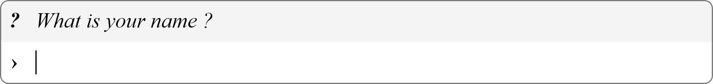

# DOM Console

This is a DOM-based console library. My goal is to ally the advantage of the javascript language, such as hot reloading and ubiquitous browser support, with the simplicity of the console interface of other languages like python.

I think beginners should not have to learn HTML, CSS, DevTools, or install any tools or library to start learning Javascript. Just copy two lines of code in an HTML file and start coding.


**Disclaimer: This project is intended for my personal use and I will not improve or maintain it if I do not have the use of it. But you are free to use and copy my code.**

## Installation

To get started just create an html file named `index.html` with the following code :

```html
<script src="https://cdn.jsdelivr.net/gh/Virgiel/dom-console/main.min.js"></script>
<script src="./code.js"></script>
```

And then create a javascript file named `code.js` in the same directory with the following code.

```js
print('Hello world!');
```

You can now open the html file in your browser and you should see a line containing "Hello world!". You are ready to code!

> What you have there is not a real website, if you want to learn real web development I can recommend these [tutorials](https://developer.mozilla.org/en-US/docs/Learn).

## Usage

This library automatically appends the dom console to the document body. All console.\* calls are redirected.

## API

### print

Print a new line to the console.

```js
function main() {
  print('Hello World!');
}
```


### err

Print a new error line to the console.

```js
function main() {
  err('Oh oh. Something went wrong...');
}
```


### warn

Print a new warning line to the console.

```js
function main() {
  warn("That's not that serious");
}
```


### success

Print a new success line to the console.

```js
function main() {
  success('Congratulation! You finally dit it!');
}
```


### info

Print a new info line to the console.

```js
function main() {
  info("A lunar distance, 384402 km, is the Moon's average distance to Earth.");
}
```


### input

Request input from the player, this function return a Promise.

```js
async function main() {
  const name = await input('What is your name ?');
}
```



## TODO

This is a list of features I might add if I find the time and/or my projects require them

- Paged console with a ring buffer
- Add more customization options
- Make it embeddable

## Licence

Unlicense
