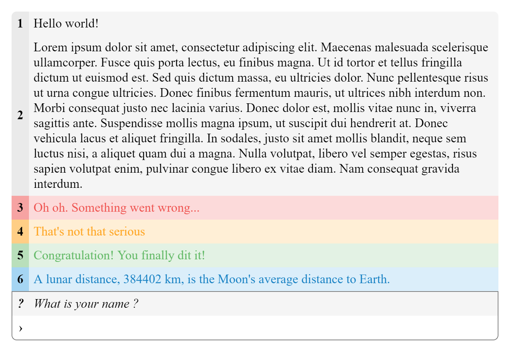
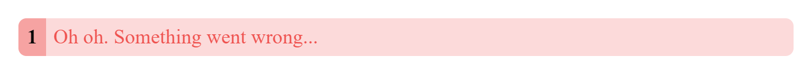
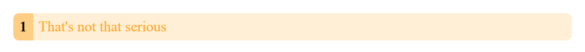
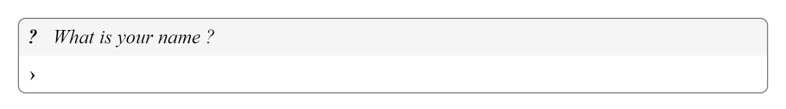

# DOM Console

I find Javascript to be a good language for learning to program. Hot reloading and the fact that each browser is a JS IDE helps beginners, but the need to learn HTML and CSS as well is an issue.

I created this library to give people I teach programming a console interface similar to what you can have with Python or C.



**Disclaimer: This project is intended for my personal use and I will not improve or maintain it if I do not have the use of it. But you are free to use and copy my code.**

## Installation

```html
<head>
  <script src="https://cdn.jsdelivr.net/gh/Virgiel/dom-console/main.min.js"></script>
</head>
<script>
  async function main() {
    // Use the dom console api
  }
</script>
```

## Usage

This library automatically append the console to the document body. When the page is loaded the main function is called and you can start using the dom console api from there. All console.\* calls are redirected to the dom console so if you copy past code it will work.

## API

### print

Print a new line to the console.

```js
function main() {
  print('Hello World!');
}
```


### err

Print a new error line to the console.

```js
function main() {
  err('Oh oh. Something went wrong...');
}
```



### warn

Print a new warning line to the console.

```js
function main() {
  warn("That's not that serious");
}
```



### success

Print a new success line to the console.

```js
function main() {
  success('Congratulation! You finally dit it!');
}
```


### info

Print a new warning info to the console.

```js
function main() {
  info("A lunar distance, 384402 km, is the Moon's average distance to Earth.");
}
```


### input

Request input from the player, this function return a Promise.

```js
async function main() {
  const name = input('What is your name ?');
}
```



## TODO

This is a list of features I might add if I find the time and/or my projects require them

- Pretty print objects
- Paged console and prevent memory overflow with a ring buffer
- Add more customization options
- Make it embeddable

## Licence

Unlicense
